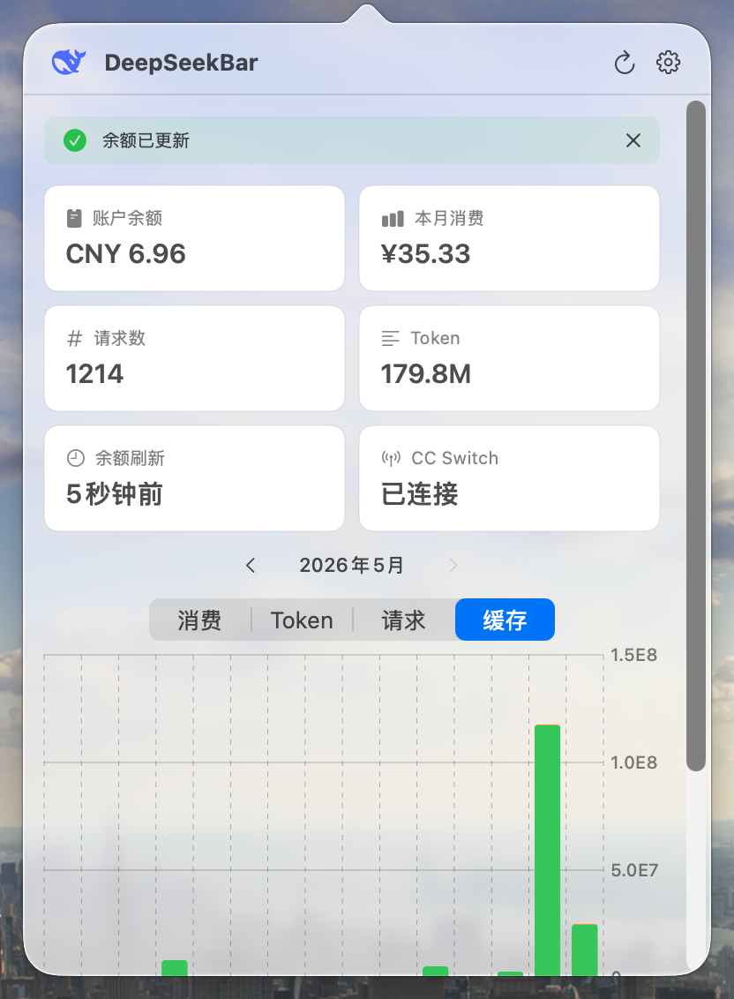
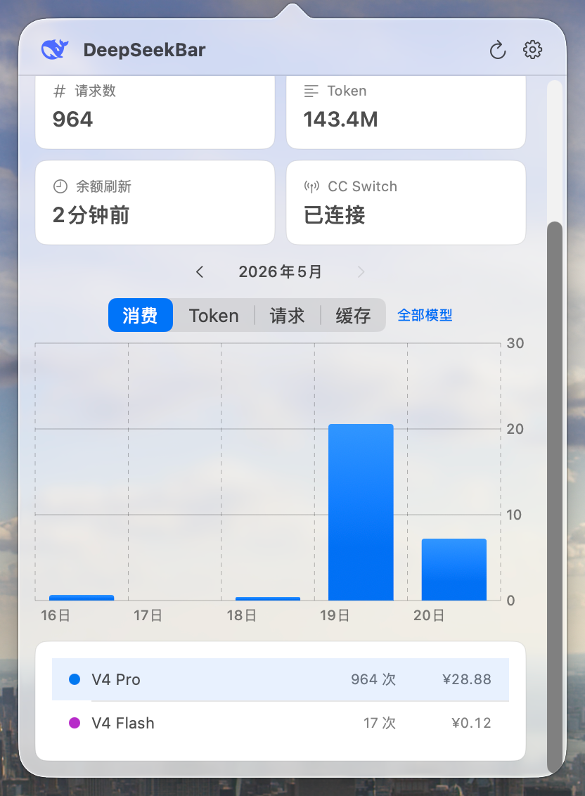
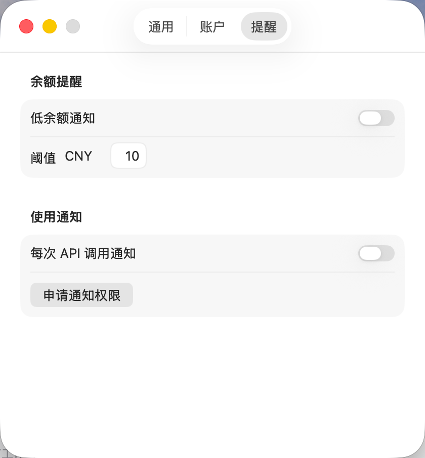
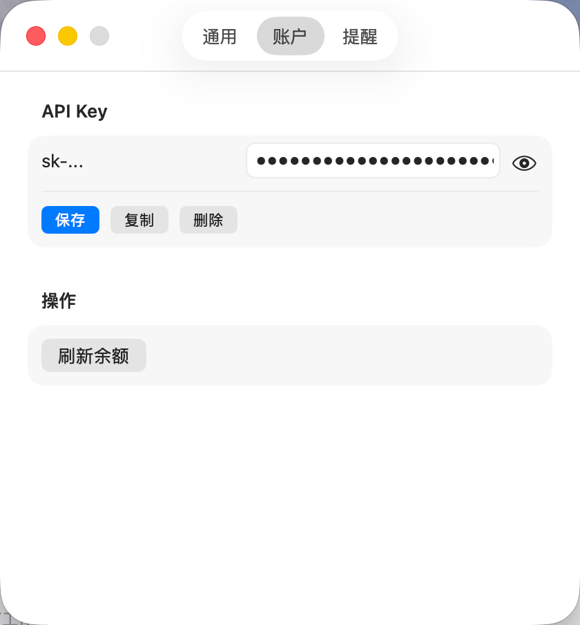
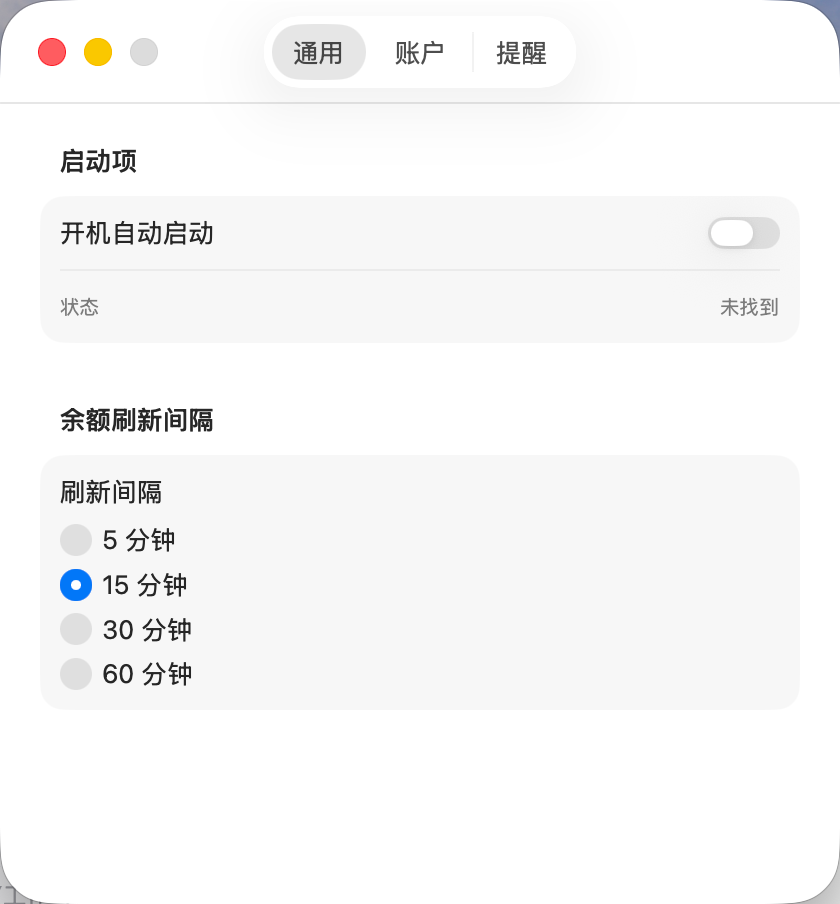

# DeepSeekBar

macOS 菜单栏应用，实时显示 DeepSeek API 账户余额和使用量统计。





---

## 功能

- **余额监控** — 菜单栏图标显示 DeepSeek 账户余额，支持定时自动刷新
- **用量统计** — 通过 [CC Switch](https://github.com/cc-switch/cc-switch) 采集请求记录，按月统计消费、Token 和请求数
- **可视化图表** — 消费柱状图、Token 趋势、请求折线、缓存命中率分析
- **模型筛选** — 按模型查看消费明细（V4 Flash / V4 Pro / V3 / R1）
- **价格估算** — 内置 DeepSeek 模型定价，自动估算无计费字段的请求消费
- **通知提醒** — 低余额告警、逐请求消费通知
- **开机启动** — 支持登录项自动启动

## 系统要求

- macOS 15.0+
- [CC Switch](https://github.com/cc-switch/cc-switch)（用于采集用量数据，可选但推荐）
- DeepSeek API Key

## 安装

### 从 Release 下载

从 [Releases](../../releases) 页面下载最新 DMG，拖入 Applications 文件夹。

首次打开时，macOS 可能提示"无法验证开发者"——右键点击应用图标，选择「打开」即可。

### 从源码构建

```bash
git clone https://github.com/<your-username>/DeepSeekBar.git
cd DeepSeekBar
swift build -c release
```

构建完成后运行：

```bash
./.build/release/DeepSeekMenuBar
```

或使用构建脚本打包为 .app 和 DMG：

```bash
bash scripts/build-app.sh
```

## 使用说明

1. 启动后菜单栏出现 DeepSeek 图标
2. 左键点击图标打开 Dashboard 面板
3. 首次使用点击右下角设置按钮，输入 DeepSeek API Key
4. 如果安装了 CC Switch，用量数据会自动同步
5. 右键点击图标显示退出菜单

## 隐私

- API Key 存储在 macOS Keychain，不会写入任何本地文件
- 所有用量数据存储在 `~/Library/Application Support/DeepSeekMenuBar/`，不会上传
- 余额查询请求仅向 `api.deepseek.com` 发送

## 技术栈

- Swift 6 / SwiftUI
- AppKit (菜单栏、Popover)
- SQLite3 (读取 CC Switch 数据库)
- macOS Keychain

## 架构

详见 [架构文档](docs/architecture.md) |
[数据流](docs/data-flow.md) |
[打包规范](docs/bundle-structure.md)

```
Views (SwiftUI)
    ↕
ViewModels (DashboardViewModel / SettingsViewModel)
    ↕
Core Stores (BalanceStore / UsageStore)
    ↕
Services (DeepSeekAPI / CCSwitchService / PersistenceService / ...)
```

## 构建验证

Release App Bundle 必须通过以下检查：

```bash
# 构建并打包
bash scripts/build-app.sh

# 从终端启动 Release App
./.build/DeepSeekMenuBar.app/Contents/MacOS/DeepSeekMenuBar

# 验证
# - 控制台无 bundle path 错误
# - 面板图标正常显示
# - 余额刷新正常
# - 用量数据正常显示
```

## 已知问题

- 首次冷启动时，如果 CC Switch 数据库记录较多，同步可能耗时较长
- 仅支持 DeepSeek V4 Flash / V4 Pro / V3 / R1 模型的定价估算

## License

MIT License. See [LICENSE](LICENSE) for details.
